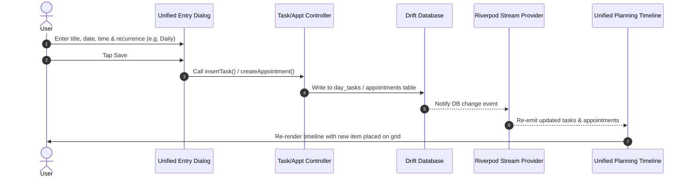
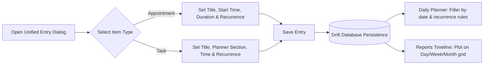
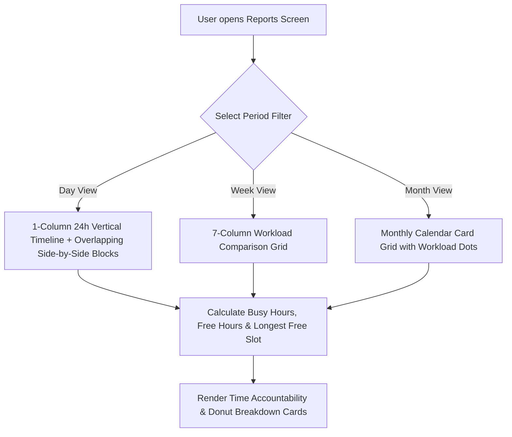
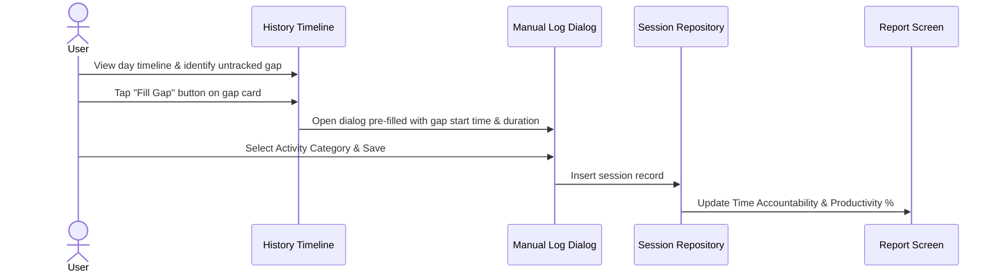

# TrackerTime - System Architecture, Component Responsibilities & Workflows Report

This report provides a technical overview of the **TrackerTime** architecture, detailing how components communicate, their individual responsibilities, system operations, and end-to-end user scenarios accompanied by **Mermaid diagrams**.

---

## 1. High-Level System Architecture

The application is built using a **Clean Architecture** pattern powered by **Flutter**, **Riverpod** for reactive state management, and **Drift (SQLite)** for offline-first local persistence.

```mermaid
graph TD
    subgraph Presentation Layer
        UI_Planner[Daily Planner Screen]
        UI_Schedule[Schedule Screen & Unified Dialog]
        UI_Session[Timer Dashboard & Gap Logger]
        UI_Reports[Reports Screen & Unified Timeline]
    end

    subgraph Application Layer (Riverpod)
        State_Planner[Task & Block Controllers]
        State_Schedule[Appointment Controller]
        State_Session[Session Controller]
        State_Reports[Report Service & Providers]
    end

    subgraph Domain Layer
        Repo_Planner[Planner Repository Contract]
        Repo_Schedule[Appointment Repository Contract]
        Repo_Session[Session Repository Contract]
        Repo_Activity[Activity Repository Contract]
    end

    subgraph Infrastructure Layer
        DB[(Drift SQLite Database)]
        Notif[Notification Service]
    end

    UI_Planner --> State_Planner
    UI_Schedule --> State_Schedule
    UI_Session --> State_Session
    UI_Reports --> State_Reports

    State_Planner --> Repo_Planner
    State_Schedule --> Repo_Schedule
    State_Session --> Repo_Session
    State_Reports --> Repo_Activity

    Repo_Planner --> DB
    Repo_Schedule --> DB
    Repo_Session --> DB
    Repo_Activity --> DB

    State_Schedule --> Notif
    State_Planner --> Notif
```

---

## 2. Component Responsibilities

| Component / Module | Responsibility | Key Files |
| :--- | :--- | :--- |
| **Activity Module** | Manages activity categories, colors, icons, target weekly goals, and daily time limits. | `activity_providers.dart`, `activity_manage_screen.dart` |
| **Planner Module** | Manages daily section blocks (Morning, Work, Evening), single-day tasks, and dynamic recurring tasks. | `planner_providers.dart`, `daily_planner_screen.dart`, `planner_repository_impl.dart` |
| **Schedule Module** | Manages appointments and recurring items, hosting the `UnifiedEntryDialog` for unified creation. | `schedule_providers.dart`, `schedule_screen.dart`, `unified_entry_dialog.dart` |
| **Session Module** | Tracks real-time timer sessions, logs past gaps, and maintains historical session logs. | `session_providers.dart`, `timer_dashboard.dart`, `session_history_list.dart` |
| **Reports & Timeline Module** | Computes productivity metrics (Tracked vs Free time, Category Donuts, Weekly Trends) and renders `UnifiedPlanningTimeline`. | `report_service.dart`, `report_screen.dart`, `unified_planning_timeline.dart` |

---

## 3. Communication Between Components

Components communicate reactively using **Riverpod Streams**:



---

## 4. End-to-End User Scenarios & Flowcharts

### Scenario A: Creating & Auto-Populating Recurring Items

When a user creates a task or appointment set to recur (e.g., Daily or Weekly on Mon/Wed/Fri), the item is saved once in the database with recurrence rules and dynamically calculated for any target date.



---

### Scenario B: Viewing & Analyzing Productivity in Reports

The user opens the **Reports Screen** to understand their time usage and free time across different periods.



---

### Scenario C: Retroactive Gap Filling (Timeline Gap Logging)

When untracked gaps exist in session logs, the user can retroactively convert free time into logged activity sessions.



---

## 5. Summary of System Operations

1. **Daily Execution**: Planner screen organizes work into Morning, Work, and Evening blocks with quick completion checkboxes.
2. **Unified Item Management**: Schedule tab acts as the central hub for managing appointments and recurring tasks with category filtering.
3. **Productivity Visualization**: Reports tab calculates busy time vs. free time, highlights neglected goals, and renders the **Google Calendar–Style Unified Planning Timeline**.
